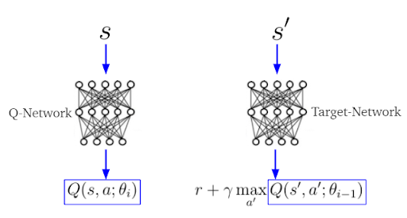

## Introduction
Snake game was developed as an educational project for OOP practice at Bauman Moscow State Technical University.

Snake moves in a limited field and her goal is to eat as many fruits as possible without crashing into walls or herself. Snake increases its length when eating an apple and dies when it collides with itself or with a wall. Game is designed for one player. User controls direction of snake's head in 4 directions: up, down, left, right, and snake's tail follows.
User cannot stop the movement of snake. Program interface is implemented in UNIX console.

In development process, following were used: MVC pattern, OOP principles (encapsulation, inheritance, dynamic polymorphism).


## DDQN Integration for Snake AI

In addition to the classic gameplay, an advanced version of the Snake game has been developed, integrating an Artificial Neural Network (ANN) using the Double Deep Q-Network (DDQN) method. This integration was aimed at creating an AI that can play the Snake game autonomously, showcasing the application of machine learning techniques in game development.

### DDQN Method
The DDQN method is an enhancement of the standard Deep Q-Network (DQN). It addresses the overestimation of action values that DQN is prone to. The key improvement in DDQN is the use of two neural networks, the Q-network and the target Q-network, both having the same architecture but with different sets of weights. The Q-network is used to select the action, while the target Q-network is used to evaluate the action. This separation reduces the overestimation bias, leading to more stable and reliable training.

<p align="center">
  
</p>

### Implementation in the Snake Game
For the Snake game, the DDQN algorithm was implemented to control the snake's movements. The input to the neural network consists of the game state, including the position of the snake, the walls, and the fruit. The output is the decision on the next move. The neural network was trained using game simulations, with the objective of maximizing the score (number of fruits eaten) while avoiding collisions.

### Research Publication
A research paper detailing the development, implementation, and results of incorporating the DDQN into the Snake game was published. This paper provides an in-depth analysis of the algorithm's performance, including the challenges faced and the strategies employed to overcome them.

For more details on the DDQN method and its implementation in the Snake game, refer to the published research paper.

[Link to the research paper](http://ptsj.ru/catalog/icec/inf_tech/952.html)

---


## Installation

````
git clone --recurse-submodules https://github.com/ArtemChapaev/Snake
cd Snake
bash setup.sh
build/snake
````

## Configuration
You can specify path to settings file by command-line flag -f (by default using "settings.txt" in game directory).

Example:
```
./snake -f "../example/path/settings.txt"
```

## Features
Right in game you can configure:
- map (size, solid walls, bonus apples, score display)
- type of graphics (symbolic or escape, color of bonuses)
- snake (speed, length change on a new level)
- control buttons
- create your own map (map constructor)

You can read more about settings on this [page](settings)

Also implemented:
- menu
- pause during game
- leaderboard
- deathscreen with game results

## Requirements
- Unix
- Git
- C++17 or higher
- Cmake >= 3.6

## License
[](https://opensource.org/licenses/MIT)

